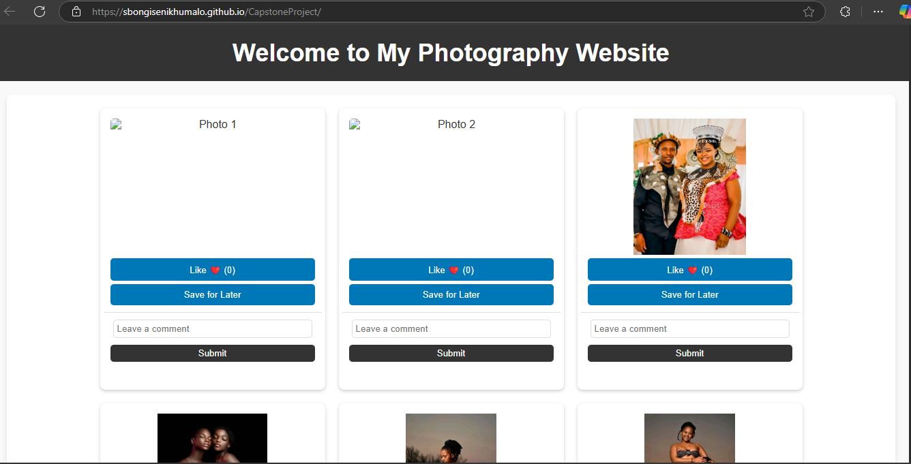
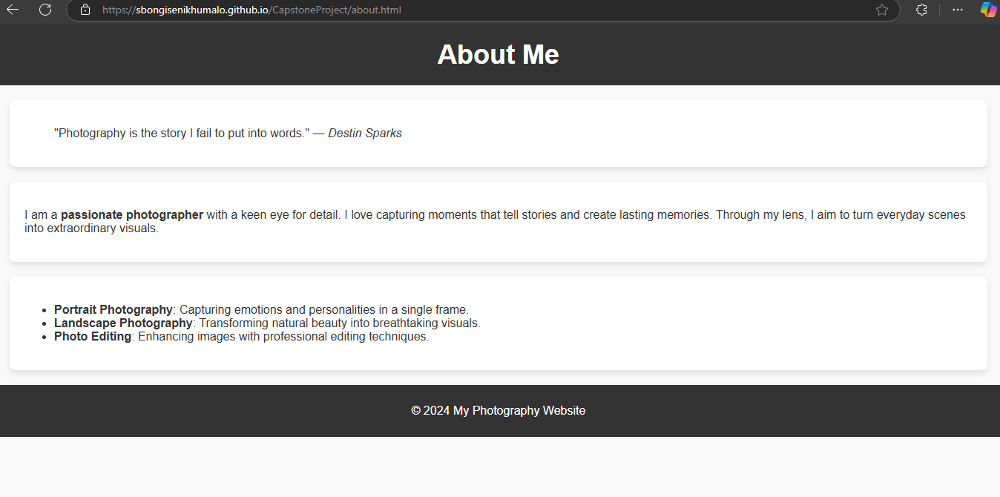
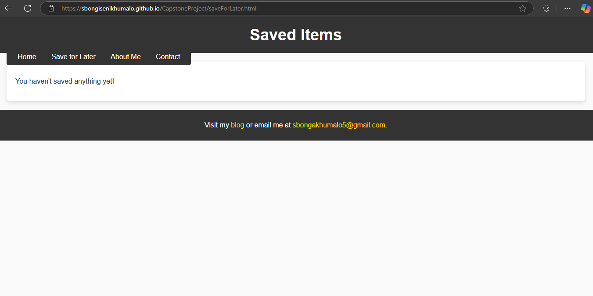
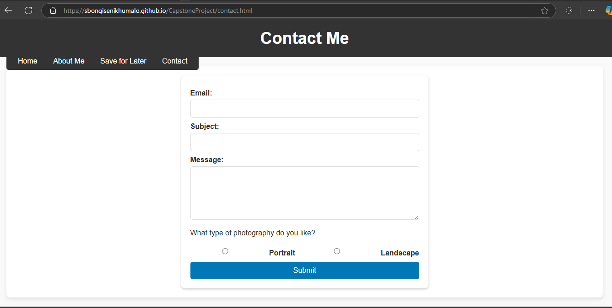

# Capstone Project

## 📌 Project Description

This project is designed to showcase my skills in **HTML, CSS, JavaScript**. It demonstrates my ability to create a responsive and interactive webpage with modern web development practices.

## 📂 Table of Contents

- [Installation](#installation)
- [Usage](#usage)
- [Screenshots](#screenshots)
- [Credits](#credits)

## Installation

1. Clone the repository:
   ```sh
   git clone https://github.com/sbongisenikhumalo/CapstoneProject.git
   ```
   2.Open index.html in a browser.

## Usage

Open the homepage and explore the features.
Navigate through the sections to learn more.
Modify the code if needed for customization.

## 📸 Screenshots

Here is a preview of the project:

### HomePage



### About Me



### Save For Later



### Contact



## Credits

Created by Sibongiseni Khumalo

4. **Save the file**.
5. **Commit and push it to GitHub**:
   ```sh
   git add README.md
   git commit -m "Added README file"
   git push origin master
   ```
